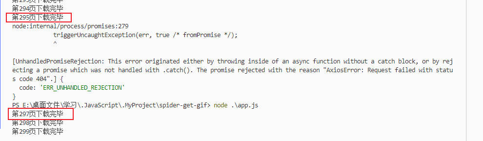
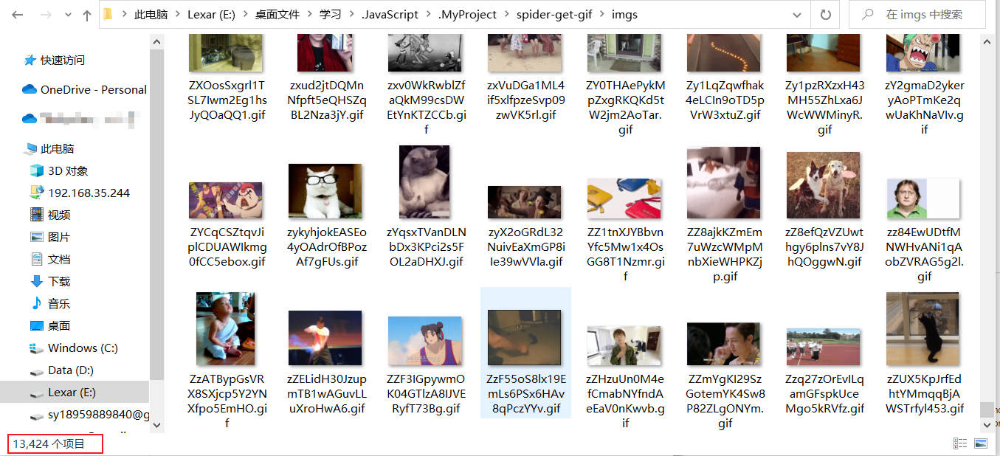
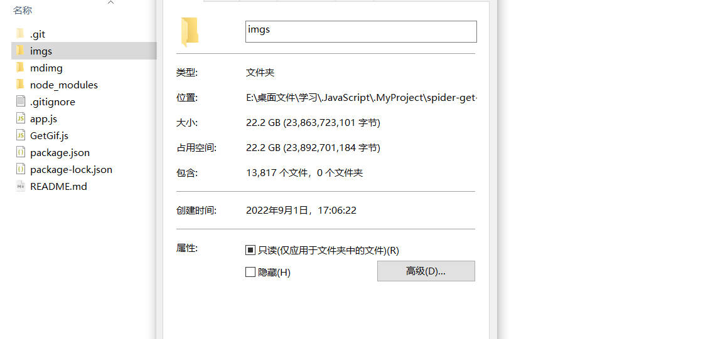

## 批量爬取某网站 `Gif`动图

```sh
git clone https://github.com/ivwv/spider-get-gif.git
# or
# git clone https://gitee.com/isyv/spider-get-gif.git
```

**使用**

> 修改 `app.js`内 `GetGif`参数
>
> - 参数为 `from`， `to`
> - `from`表示开始页数
> - `to`表示结束页数
> - 每一页有38张动图

```js
const GetGif = require("./GetGif.js");
(async () => {
  const getGif = new GetGif(1, 300);
})();
```

```sh
npm i
mkdir imgs
node app.js
```

> **注意**
>
> 下载时会由于网络请求太多会报错
>
> 如下图：
>
> - 当295页下载完毕，然后报错了
> - 接下来就修改 `app.js` 从295+2的位置 297 开始
> - 避免下载296页时因为文件名冲突报错



**最终效果**



---

